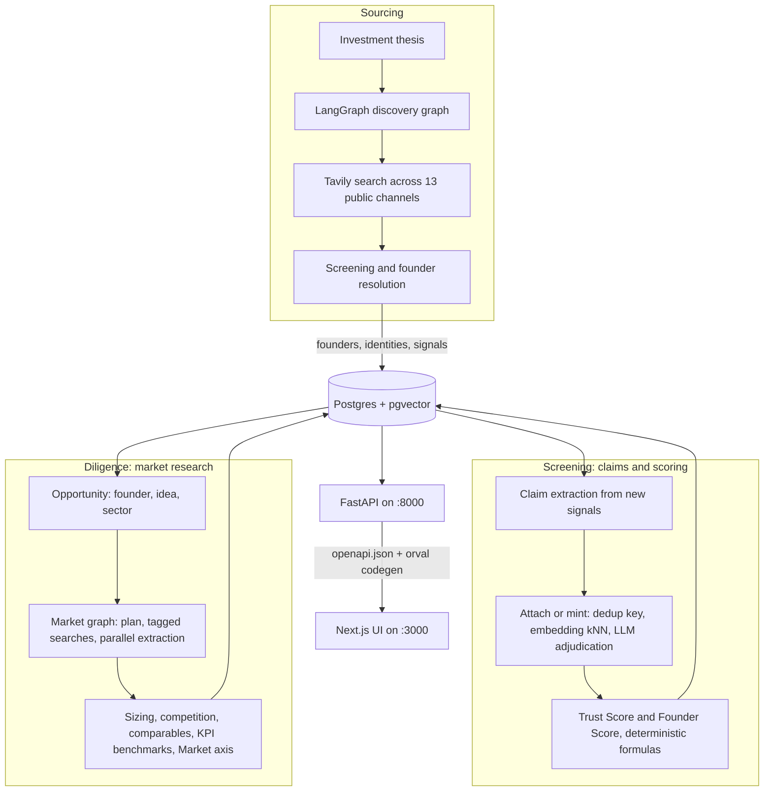

# ArgOS

ArgOS is an AI-native VC operating system, built for Challenge 02 (The VC Brain, Maschmeyer
Group x Hack-Nation). It runs the
funnel **Sourcing, Screening, Diligence, Decision**: discover founders from their public
footprint before they appear in any startup database, resolve noisy signals into corroborated
claims with auditable trust scores, research the market around an opportunity with cited
figures, and surface all of it in a live product UI.

Design docs: `docs/public/Technical Design Document.md` (system design),
`docs/claims-layer.md` (claims and scoring), `docs/market-layer.md` (market research agent),
`docs/demo.md` (how to record the demo).

---

## Architecture



How the pieces run in practice:

1. **Sourcing** (`backend/app/sourcing/`): a LangGraph graph takes the investment thesis,
   searches 13 public channels through Tavily (arXiv, GitHub, Devpost, Product Hunt, patents,
   accelerators, and more), screens the hits, resolves them to people, and persists founders,
   identities, and signals. Triggered manually from the UI or `POST /discovery/run`.
2. **Claims** (`backend/app/claims/`): new signals are collapsed into deduplicated,
   corroborated claims (exact dedup key hit, then embedding kNN, then LLM adjudication on the
   few candidates). Trust Score per claim and Founder Score per person are deterministic
   formulas over the evidence, so every number can be audited.
3. **Market research** (`backend/app/market/`): given an opportunity, a second LangGraph graph
   plans searches, extracts sizing, competition, comparables, and KPI benchmarks in parallel,
   and synthesizes the Market axis. Every figure carries a basis of `reported`,
   `estimated_bottom_up`, or `gap`; a flagged gap beats an invented number.
4. **Contract and UI**: Pydantic response models export to `backend/openapi.json`; orval
   generates the typed TanStack Query client the Next.js app uses. A backend schema change the
   frontend has not caught up with becomes a TypeScript error.

| Piece | Where | Runs on |
|---|---|---|
| Postgres + pgvector | `docker-compose.yml` | `:5433` |
| Backend (FastAPI, incl. inbound `/apply` intake) | `backend/` | `localhost:8000` |
| Frontend (Next.js 16 + TypeScript) | `frontend/` | `localhost:3000` |

---

## Prerequisites

- **Docker Desktop** (Postgres + pgvector)
- **[uv](https://docs.astral.sh/uv/)** (Python 3.12 backend)
- **Node 20.19 or newer** and npm (frontend)
- **OpenAI + Tavily API keys**, only needed to run discovery and the agents; browsing existing
  data needs neither

## Run the full stack

From the repo root, in order:

```bash
cp .env.example .env          # fill OPENAI_API_KEY and TAVILY_API_KEY
docker compose up -d          # Postgres + pgvector on :5433
```

Backend:

```bash
cd backend
uv sync                                              # create .venv, install deps
uv run alembic upgrade head                          # apply migrations
uv run python -m uvicorn app.main:app --reload       # http://localhost:8000  (/docs for the schema)
```

Frontend:

```bash
cd frontend
npm install
npm run dev                                           # http://localhost:3000
```

Verify: <http://localhost:8000/health> returns `{"status":"ok","signals":N}` and
<http://localhost:3000> shows the home page.

---

## Using the app

- **Home** (`/`): what ArgOS is, the funnel, and the team. Opens with the
  signal-convergence animation.
- **Sourcing** (outbound): live signal feed (5 second poll, new signals flash in), search,
  type filters, pagination, the channels being monitored, and a Run discovery button. Every
  card opens its real source.
- **Inbound**: the applications inbox. Founders email a pitch deck and company name; the
  intake agent (`POST /apply`) extracts, claim-mines and prescreens it, and it becomes an
  opportunity in the screening loop.
- **Founders**: searchable, sortable, filterable table of every resolved person with their
  Founder Score. The detail view shows identity links, education, corroborated claims with
  per-claim Trust Scores, and the full signal timeline.
- **Opportunities**: every deal scored on the three-axis screen (founder, market, idea versus
  market) with a Run screening button per deal. The detail embeds the market analysis
  (TAM/SAM/SOM and KPI figures with reported versus estimated basis chips, comparables,
  competitors, flagged gaps) and the investment memo, generated on demand.
- **Thesis**: the active investment thesis that drives discovery.

Populate data: click **Run discovery** on `/sourcing` (30 to 60 seconds, needs API keys), or
`curl -X POST http://localhost:8000/discovery/run`. Then generate claims with
`uv run python -m app.claims.run` from `backend/`. For market research,
`uv run python -m app.market.run` is a no-DB smoke run that writes
`backend/examples/market_live_output.json`; persist analyses for the UI by calling
`app.market.service.run_market_analysis(...)` against an opportunity. Continuous scheduling
(`backend/app/scheduler.py`) is on by default: discovery hourly, refresh every 6 hours; set
`CRON_ENABLED=false` in `.env` to disable it.

## API surface

| Method | Path | Purpose |
|---|---|---|
| GET | `/health` | heartbeat and signal count |
| GET | `/signals?limit=` | signal feed |
| POST | `/signals/ingest` | ingest one signal directly |
| POST | `/apply` | inbound intake: deck PDF + company name, prescreened |
| POST | `/discovery/run` | run the discovery graph |
| GET | `/founders`, `/founders/{id}` | founders list and detail (claims, Founder Score) |
| GET | `/sourcing-channels` | monitored channels |
| GET | `/thesis` | active thesis |
| GET | `/market/opportunities`, `/market/opportunities/{id}` | market analyses |
| POST/GET | `/opportunities`, `/opportunities/{id}` | opportunities for the screening loop |
| POST | `/opportunities/{id}/screen` | run the three-axis screening |
| POST/GET | `/opportunities/{id}/memo` | generate / read the investment memo |

Full schema at <http://localhost:8000/docs>.

## Type-safe FE/BE contract

Pydantic response models are the source of truth:

```
backend Pydantic models -> app.export_openapi -> backend/openapi.json -> orval -> frontend typed client + hooks
```

After any backend response-model change:

```bash
cd backend  && uv run python -m app.export_openapi
cd frontend && npm run api:gen && npm run typecheck   # typecheck is the drift gate
```

## Tests and checks

```bash
cd backend
uv run pytest -q          # most tests use the real dev DB in transactions that roll back
uv run ruff check .
uv run pyright

cd frontend
npm run typecheck
npm run lint
npm run build
```

Postgres must be up and migrated for `pytest`; only `test_contract.py` is DB-free.

## Troubleshooting

- **Errors about `vector`**: use the `pgvector/pgvector` image from `docker-compose.yml`;
  plain Postgres fails the migrations.
- **Port 8000 or 3000 taken**: a leftover server. macOS/Linux: `lsof -i :8000`;
  Windows: `Get-NetTCPConnection -LocalPort 8000`.
- **Discovery returns nothing**: check `OPENAI_API_KEY` and `TAVILY_API_KEY` in `.env`.
- **Disk pressure**: `frontend/.next/` is a regenerable cache and safe to delete.

## Repo layout

```
backend/     FastAPI app: sourcing, inbound intake (/apply), claims, market research, opportunities
frontend/    Next.js app: home, sourcing, founders, thesis, market research
docs/        design docs, demo guide, challenge brief
docker-compose.yml   pgvector Postgres (:5433)
.env.example         copy to .env at the root
```

## Authors

| Name | Email | LinkedIn |
|---|---|---|
| Rishabh Tiwari | <rishtiwari98@gmail.com> | [icon1c](https://www.linkedin.com/in/icon1c/) |
| Alexandre Boving | <alexandre.boving@gmail.com> | [alexandre-boving](https://www.linkedin.com/in/alexandre-boving-04422a1b6/) |
| Florian Sprick | <floriansprick@hotmail.com> | [florian-sprick](https://www.linkedin.com/in/florian-sprick/) |
